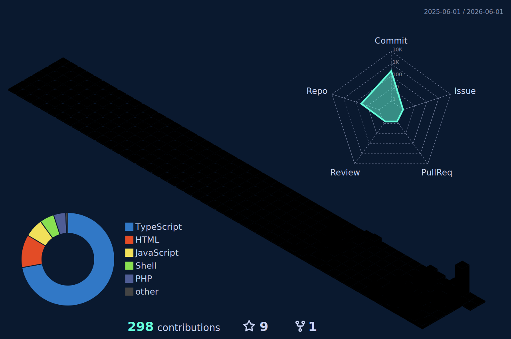
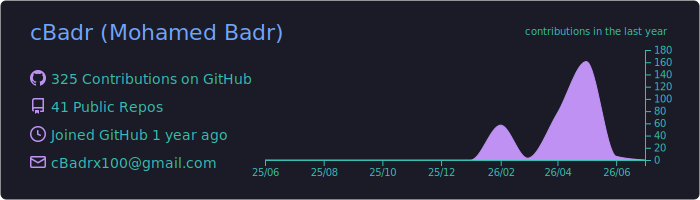
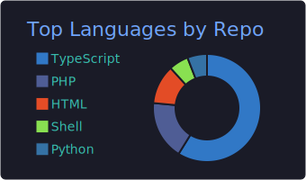
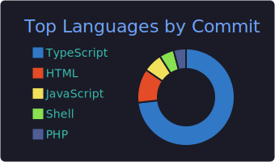
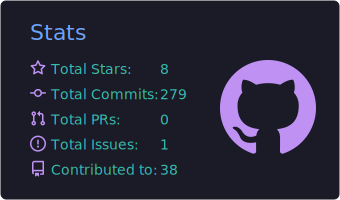
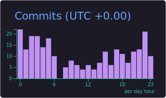

<!-- ════════════════════════════════════════════════════════════════ -->
<!--    MOHAMED BADR — DIGITAL PORTFOLIO                              -->
<!--    Theme · Deep Navy · Cyan Holographic · Cinematic              -->
<!--    Typography · Cinzel · Cormorant Garamond · Fira Code          -->
<!-- ════════════════════════════════════════════════════════════════ -->

<!-- ─── HERO ────────────────────────────────────────────────────── -->
<a href="https://github.com/cBadr">
  
</a>

<!-- ─── TYPING ANIMATION ────────────────────────────────────────── -->
<div align="center">

<a href="https://github.com/cBadr">
  
</a>

<br/><br/>

<!-- ─── METADATA BADGES ─────────────────────────────────────────── -->


<a href="https://t.me/Idlexaz"></a>

</div>

<!-- ─── DIVIDER ─────────────────────────────────────────────────── -->


<!-- ─── §01 · ABOUT ─────────────────────────────────────────────── -->
<div align="center">
  <h2>
    <kbd>&nbsp;◇&nbsp;</kbd>&nbsp;&nbsp;<samp>§ 01 · ABOUT</samp>&nbsp;&nbsp;<kbd>&nbsp;◇&nbsp;</kbd>
  </h2>
  <i>The architect behind the code</i>
</div>

<br/>

<table>
<tr>
<td width="55%" valign="top">

```yaml
~ identity:
    name:        "Mohamed Badr"
    alias:       "cBadr"
    role:        "Full-Stack Developer"
    philosophy:  "craft.products.that.matter()"

~ stack:
    backend:     [Laravel, PHP, Node.js, Supabase]
    frontend:    [Next.js, React, TailwindCSS]
    database:    [MySQL, PostgreSQL, Supabase]
    cloud:       [Vercel, Cloudflare, NameCheap]

~ now:
    building:    "Shortaty SaaS · ShortTool"
    learning:    "Advanced Next.js 16 patterns"
    chasing:     "elegance · craftsmanship · velocity"

~ reach:
    web:         "orcax.click"
    telegram:    "@Idlexaz"   # primary channel
```

</td>
<td width="45%" valign="middle" align="center">

<!-- Snake animation - eats contribution dots -->


<br/>

<sub><i>The snake feeds on my daily contributions —<br/>regenerated every 12 hours</i></sub>

</td>
</tr>
</table>

<!-- ─── DIVIDER ─────────────────────────────────────────────────── -->


<!-- ─── §02 · TELEGRAM CTA (cinematic banner) ───────────────────── -->
<div align="center">
  <h2>
    <kbd>&nbsp;◆&nbsp;</kbd>&nbsp;&nbsp;<samp>§ 02 · DIRECT LINE</samp>&nbsp;&nbsp;<kbd>&nbsp;◆&nbsp;</kbd>
  </h2>
  <i>One tap · zero friction</i>
</div>

<br/>

<a href="https://t.me/Idlexaz">
  
</a>

<!-- ─── DIVIDER ─────────────────────────────────────────────────── -->


<!-- ─── §03 · TECH STACK ────────────────────────────────────────── -->
<div align="center">
  <h2>
    <kbd>&nbsp;❖&nbsp;</kbd>&nbsp;&nbsp;<samp>§ 03 · CRAFTSMANSHIP</samp>&nbsp;&nbsp;<kbd>&nbsp;❖&nbsp;</kbd>
  </h2>
  <i>Tools forged for elegance &amp; velocity</i>
</div>

<br/>

<div align="center">

<table>
<tr>
<td align="center"><b><sub>LANGUAGES</sub></b></td>
<td>
  
  
  
  
  
  
</td>
</tr>
<tr>
<td align="center"><b><sub>FRAMEWORKS</sub></b></td>
<td>
  
  
  
  
  
  
</td>
</tr>
<tr>
<td align="center"><b><sub>DATA &amp; CLOUD</sub></b></td>
<td>
  
  
  
  
  
</td>
</tr>
<tr>
<td align="center"><b><sub>WORKBENCH</sub></b></td>
<td>
  
  
  
  
  
  
</td>
</tr>
</table>

<br/>


</div>

<!-- ─── DIVIDER ─────────────────────────────────────────────────── -->


<!-- ─── §04 · FEATURED PROJECTS ─────────────────────────────────── -->
<div align="center">
  <h2>
    <kbd>&nbsp;✦&nbsp;</kbd>&nbsp;&nbsp;<samp>§ 04 · SELECTED WORK</samp>&nbsp;&nbsp;<kbd>&nbsp;✦&nbsp;</kbd>
  </h2>
  <i>Six projects worth your attention</i>
</div>

<br/>

<div align="center">

<table>
<tr>
<td width="50%"><a href="https://github.com/cBadr/short-tool"></a></td>
<td width="50%"><a href="https://github.com/cBadr/Shortaty"></a></td>
</tr>
<tr>
<td><a href="https://github.com/cBadr/php-redirector"></a></td>
<td><a href="https://github.com/cBadr/AI-Screens"></a></td>
</tr>
<tr>
<td><a href="https://github.com/cBadr/Bot-Saas"></a></td>
<td><a href="https://github.com/cBadr/Tools-Hub"></a></td>
</tr>
</table>

</div>

<!-- ─── DIVIDER ─────────────────────────────────────────────────── -->


<!-- ─── §05 · 3D CONTRIBUTIONS ──────────────────────────────────── -->
<div align="center">
  <h2>
    <kbd>&nbsp;⬥&nbsp;</kbd>&nbsp;&nbsp;<samp>§ 05 · DIMENSION</samp>&nbsp;&nbsp;<kbd>&nbsp;⬥&nbsp;</kbd>
  </h2>
  <i>A year of commits rendered in three dimensions</i>
</div>

<br/>

<div align="center">

<picture>
  <source media="(prefers-color-scheme: dark)" srcset="./profile-3d-contrib/profile-night-rainbow.svg"/>
  <source media="(prefers-color-scheme: light)" srcset="./profile-3d-contrib/profile-night-view.svg"/>
  
</picture>

<sub><i>Refreshed daily · synced with real contribution data</i></sub>

</div>

<!-- ─── DIVIDER ─────────────────────────────────────────────────── -->


<!-- ─── §06 · STATS ─────────────────────────────────────────────── -->
<div align="center">
  <h2>
    <kbd>&nbsp;⟡&nbsp;</kbd>&nbsp;&nbsp;<samp>§ 06 · ANALYTICS</samp>&nbsp;&nbsp;<kbd>&nbsp;⟡&nbsp;</kbd>
  </h2>
  <i>Numbers that tell a story</i>
</div>

<br/>

<div align="center">

<table>
<tr>
<td width="50%"></td>
<td width="50%"></td>
</tr>
</table>


<br/><br/>


<br/><br/>


</div>

<!-- ─── DIVIDER ─────────────────────────────────────────────────── -->


<!-- ─── §07 · SUMMARY CARDS ─────────────────────────────────────── -->
<div align="center">
  <h2>
    <kbd>&nbsp;⬦&nbsp;</kbd>&nbsp;&nbsp;<samp>§ 07 · PORTRAIT</samp>&nbsp;&nbsp;<kbd>&nbsp;⬦&nbsp;</kbd>
  </h2>
  <i>Five facets of a developer&apos;s rhythm</i>
</div>

<br/>

<div align="center">

<table>
<tr>
<td></td>
<td></td>
</tr>
<tr>
<td></td>
<td></td>
</tr>
<tr>
<td colspan="2" align="center"></td>
</tr>
</table>

<sub><i>Five cards · regenerated each midnight</i></sub>

</div>

<!-- ─── DIVIDER ─────────────────────────────────────────────────── -->


<!-- ─── §08 · AUTOMATION ────────────────────────────────────────── -->
<div align="center">
  <h2>
    <kbd>&nbsp;⚙&nbsp;</kbd>&nbsp;&nbsp;<samp>§ 08 · LIVING DOCUMENT</samp>&nbsp;&nbsp;<kbd>&nbsp;⚙&nbsp;</kbd>
  </h2>
  <i>This README breathes · three workflows keep it alive</i>
</div>

<br/>

<div align="center">

<table>
<tr>
<td align="center" width="33%">
<a href="https://github.com/cBadr/cBadr/actions/workflows/snake.yml"></a>
<br/><br/>
<sub><b>Every 12 hours</b><br/>Regenerates the snake animation<br/>eating contribution dots</sub>
</td>
<td align="center" width="33%">
<a href="https://github.com/cBadr/cBadr/actions/workflows/3d-contrib.yml"></a>
<br/><br/>
<sub><b>Daily · 00:00 UTC</b><br/>Rebuilds the 3D contribution<br/>calendar with latest commits</sub>
</td>
<td align="center" width="33%">
<a href="https://github.com/cBadr/cBadr/actions/workflows/profile-summary-cards.yml"></a>
<br/><br/>
<sub><b>Daily · 00:00 UTC</b><br/>Refreshes profile summary<br/>statistics cards</sub>
</td>
</tr>
</table>

</div>

<!-- ─── DIVIDER ─────────────────────────────────────────────────── -->


<!-- ─── §09 · QUOTE ─────────────────────────────────────────────── -->
<div align="center">
  <h2>
    <kbd>&nbsp;✧&nbsp;</kbd>&nbsp;&nbsp;<samp>§ 09 · DAILY REFLECTION</samp>&nbsp;&nbsp;<kbd>&nbsp;✧&nbsp;</kbd>
  </h2>
</div>

<br/>

<div align="center">
  
</div>

<!-- ─── DIVIDER ─────────────────────────────────────────────────── -->


<!-- ─── §10 · CONTACT ───────────────────────────────────────────── -->
<div align="center">
  <h2>
    <kbd>&nbsp;◈&nbsp;</kbd>&nbsp;&nbsp;<samp>§ 10 · CONNECT</samp>&nbsp;&nbsp;<kbd>&nbsp;◈&nbsp;</kbd>
  </h2>
  <i>Four doors · open round the clock</i>
</div>

<br/>

<div align="center">

<table>
<tr>
<td align="center" width="180">
<a href="https://t.me/Idlexaz">
  
  <br/><br/><b>@Idlexaz</b>
</a>
</td>
<td align="center" width="180">
<a href="mailto:cBadrx100@gmail.com">
  
  <br/><br/><b>Direct mail</b>
</a>
</td>
<td align="center" width="180">
<a href="http://orcax.click">
  
  <br/><br/><b>orcax.click</b>
</a>
</td>
<td align="center" width="180">
<a href="https://github.com/cBadr">
  
  <br/><br/><b>@cBadr</b>
</a>
</td>
</tr>
</table>

<br/>

<a href="https://t.me/Idlexaz">
  
</a>

</div>

<br/>

<!-- ─── FOOTER ──────────────────────────────────────────────────── -->

