<!-- ============================================================= -->
<!--    Mohamed Badr — GitHub Profile README                       -->
<!--    Theme: Dark Navy · Cyan Accent · Royal Blue                -->
<!--    Auto-generated assets refresh via GitHub Actions           -->
<!-- ============================================================= -->

<!-- ========== CUSTOM ANIMATED BANNER (hand-crafted SVG) ========== -->
<a href="https://github.com/cBadr">
  
</a>

<div align="center">

<!-- ========== TYPING ANIMATION ========== -->
<a href="https://github.com/cBadr">
  
</a>

<br/>

<!-- ========== PROFILE BADGES ========== -->
<p>
  
  
  
  <a href="https://t.me/Idlexaz"></a>
</p>

</div>

<!-- ========== SECTION DIVIDER ========== -->


<!-- ========== ABOUT ME ========== -->
##  &nbsp; About Me

<table>
<tr>
<td width="55%" valign="top">

```yaml
👨‍💻 Developer:
  name: "Mohamed Badr"
  alias: "cBadr"
  role: "Full-Stack Developer"
  focus: "SaaS Products & Automation"

🛠️ Stack:
  backend:  [Laravel, PHP, Node.js, Supabase]
  frontend: [Next.js, React, TailwindCSS]
  database: [MySQL, PostgreSQL, Supabase]
  tools:    [Git, Docker, Vercel, NameCheap]

🚀 Currently:
  - Building: "Shortaty SaaS & ShortTool"
  - Learning: "Advanced Next.js 16 patterns"
  - Goal:     "Ship products that matter"

🌐 Web:    "orcax.click"
📨 Telegram: "@Idlexaz"
```

</td>
<td width="45%" valign="middle" align="center">

<!-- Auto-generated snake animation (eats contribution dots) -->


<sub><b>🐍 Auto-regenerates every 12 hours via GitHub Actions</b></sub>

</td>
</tr>
</table>

<!-- ========== TELEGRAM CTA BANNER ========== -->
<div align="center">

###  &nbsp; Let's Connect on Telegram &nbsp;

<a href="https://t.me/Idlexaz">
  
</a>

<a href="https://t.me/Idlexaz">
  
</a>

</div>

<!-- ========== SECTION DIVIDER ========== -->


<!-- ========== TECH STACK ========== -->
##  &nbsp; Tech Stack & Tools

<div align="center">

### 💻 &nbsp; Languages

<p>
  
  
  
  
  
  
</p>

### ⚡ &nbsp; Frameworks & Libraries

<p>
  
  
  
  
  
  
</p>

### 🗄️ &nbsp; Databases & Cloud

<p>
  
  
  
  
  
</p>

### 🛠️ &nbsp; Tools & DevOps

<p>
  
  
  
  
  
  
</p>

<br/>


</div>

<!-- ========== SECTION DIVIDER ========== -->


<!-- ========== FEATURED PROJECTS ========== -->
##  &nbsp; Featured Projects

<div align="center">

<table>
<tr>
<td width="50%" valign="top">

<a href="https://github.com/cBadr/short-tool">
  
</a>

</td>
<td width="50%" valign="top">

<a href="https://github.com/cBadr/Shortaty">
  
</a>

</td>
</tr>
<tr>
<td width="50%" valign="top">

<a href="https://github.com/cBadr/php-redirector">
  
</a>

</td>
<td width="50%" valign="top">

<a href="https://github.com/cBadr/AI-Screens">
  
</a>

</td>
</tr>
<tr>
<td width="50%" valign="top">

<a href="https://github.com/cBadr/Bot-Saas">
  
</a>

</td>
<td width="50%" valign="top">

<a href="https://github.com/cBadr/Tools-Hub">
  
</a>

</td>
</tr>
</table>

</div>

<!-- ========== SECTION DIVIDER ========== -->


<!-- ========== 3D CONTRIBUTIONS — AUTO-GENERATED ========== -->
##  &nbsp; 3D Contribution Calendar

<div align="center">

<picture>
  <source media="(prefers-color-scheme: dark)" srcset="./profile-3d-contrib/profile-night-rainbow.svg"/>
  <source media="(prefers-color-scheme: light)" srcset="./profile-3d-contrib/profile-night-view.svg"/>
  
</picture>

<sub><b>🎲 Auto-regenerated daily via GitHub Actions — </b><a href="https://github.com/cBadr/cBadr/actions/workflows/3d-contrib.yml"><b>workflow</b></a></sub>

</div>

<!-- ========== SECTION DIVIDER ========== -->


<!-- ========== GITHUB STATS ========== -->
##  &nbsp; GitHub Analytics

<div align="center">

<table>
<tr>
<td width="50%">


</td>
<td width="50%">


</td>
</tr>
</table>


<br/><br/>


<br/><br/>

<!-- ========== ACTIVITY GRAPH ========== -->


</div>

<!-- ========== SECTION DIVIDER ========== -->


<!-- ========== PROFILE SUMMARY CARDS — AUTO-GENERATED ========== -->
##  &nbsp; Profile Summary Cards

<div align="center">

<table>
<tr>
<td></td>
<td></td>
</tr>
<tr>
<td></td>
<td></td>
</tr>
<tr>
<td colspan="2" align="center"></td>
</tr>
</table>

<sub><b>📊 Auto-regenerated daily via GitHub Actions — synced with real activity data</b></sub>

</div>

<!-- ========== SECTION DIVIDER ========== -->


<!-- ========== AUTOMATED WORKFLOWS BADGE ========== -->
##  &nbsp; Automation Powering this Profile

<div align="center">

This README isn't static — it's **alive**. Three GitHub Actions workflows refresh content on schedule:

<table>
<tr>
<td align="center" width="33%">

<a href="https://github.com/cBadr/cBadr/actions/workflows/snake.yml">

</a>

<sub><b>Every 12 hours</b><br/>Regenerates the snake animation eating contribution dots</sub>

</td>
<td align="center" width="33%">

<a href="https://github.com/cBadr/cBadr/actions/workflows/3d-contrib.yml">

</a>

<sub><b>Daily at 00:00 UTC</b><br/>Rebuilds the 3D contribution calendar with latest commits</sub>

</td>
<td align="center" width="33%">

<a href="https://github.com/cBadr/cBadr/actions/workflows/profile-summary-cards.yml">

</a>

<sub><b>Daily at 00:00 UTC</b><br/>Refreshes profile summary statistics cards</sub>

</td>
</tr>
</table>

</div>

<!-- ========== SECTION DIVIDER ========== -->


<!-- ========== QUOTE ========== -->
<div align="center">

##  &nbsp; Quote of the Day


</div>

<!-- ========== SECTION DIVIDER ========== -->


<!-- ========== CONTACT ========== -->
##  &nbsp; Connect with Me

<div align="center">

<table>
<tr>
<td align="center" width="180">
<a href="https://t.me/Idlexaz">
  
  <br/><br/>
  <b>@Idlexaz</b>
</a>
</td>
<td align="center" width="180">
<a href="mailto:cBadrx100@gmail.com">
  
  <br/><br/>
  <b>cBadrx100@gmail.com</b>
</a>
</td>
<td align="center" width="180">
<a href="http://orcax.click">
  
  <br/><br/>
  <b>orcax.click</b>
</a>
</td>
<td align="center" width="180">
<a href="https://github.com/cBadr">
  
  <br/><br/>
  <b>@cBadr</b>
</a>
</td>
</tr>
</table>

<br/>

### 💬 &nbsp; Got a project idea? &nbsp; Let's build it together!

<a href="https://t.me/Idlexaz">
  
</a>

</div>

<!-- ========== FOOTER ========== -->
<br/>


<div align="center">

<sub><b>⚡ "Let's Fly .. 😍🔥" — Building one product at a time</b></sub>

</div>
