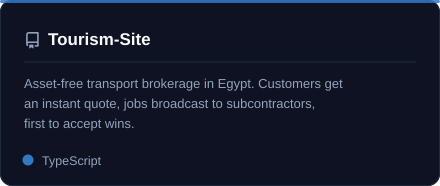
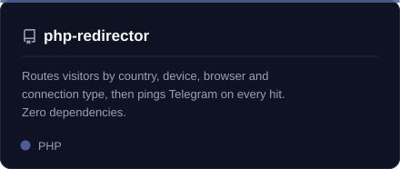
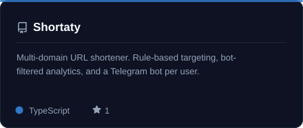
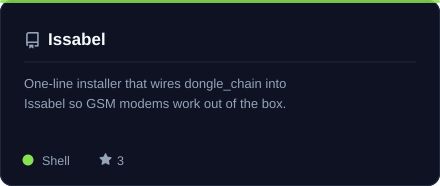
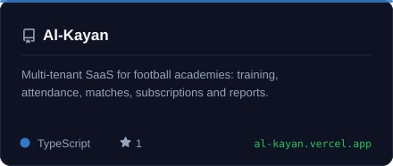
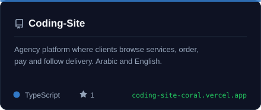
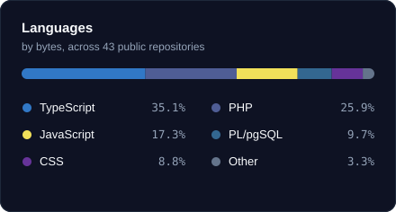

<!--
  Mohamed Badr (@cBadr) — profile README
  Every image below is either committed to this repo or generated by a
  workflow in this repo. Run `python scripts/build_assets.py` after editing
  the numbers or the project list in that script.
-->

## Selected work

<table>
<tr>
<td width="50%"></td>
<td width="50%"></td>
</tr>
<tr>
<td></td>
<td></td>
</tr>
<tr>
<td></td>
<td></td>
</tr>
</table>

<a href="https://github.com/cBadr?tab=repositories">Browse the other 37 public repositories</a>

## Stack

<table>
<tr>
<td><b>Languages</b></td>
<td>

</td>
</tr>
<tr>
<td><b>Frameworks</b></td>
<td>

</td>
</tr>
<tr>
<td><b>Data</b></td>
<td>

</td>
</tr>
<tr>
<td><b>Infra</b></td>
<td>

</td>
</tr>
</table>

## Activity

<table>
<tr>
<td width="50%" valign="top"></td>
<td width="50%" valign="top">

</td>
</tr>
</table>

<picture>
  <source media="(prefers-color-scheme: dark)" srcset="https://raw.githubusercontent.com/cBadr/cBadr/output/snake-dark.svg"/>
  <source media="(prefers-color-scheme: light)" srcset="https://raw.githubusercontent.com/cBadr/cBadr/output/snake.svg"/>
  
</picture>

## Contact

I take on freelance work and collaborations. Telegram gets the fastest reply.

